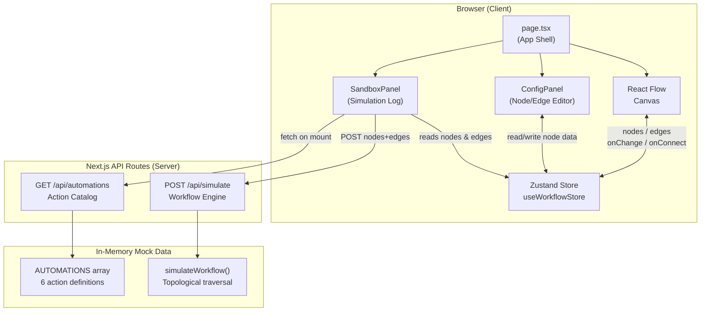

# HR Workflow Designer

A drag-and-drop workflow builder for HR processes. Design, configure, and simulate multi-step approval and automation flows visually — no backend infrastructure required. Built with Next.js, React Flow, Zustand, and TypeScript.


---

## Features

- **Visual Canvas** — Drag & drop nodes onto a React Flow canvas; pan, zoom, and connect freely
- **Node Types** — Start, End, Task, Approval, and Automated Action nodes
- **Config Panel** — Click any node or edge to edit its properties in a side panel
- **Undo / Redo** — Full history stack via Zustand
- **Context Menu** — Right-click canvas or nodes for quick add/delete actions
- **Auto-layout** — One-click Dagre-based graph cleanup
- **Import / Export** — Save and load workflows as JSON
- **Sandbox Simulation** — Step-through workflow execution with a live log; supports a force-error mode
- **Mock API Layer** — Two Next.js Route Handlers power the Action Catalog and simulation engine
- **Dark / Light Mode** — System-aware theme with manual toggle
- **Unsaved Changes Warning** — Browser `beforeunload` guard

---

## Architecture



### Layer Summary

| Layer | Technology | Role |
|---|---|---|
| **App Shell** | Next.js App Router (`page.tsx`) | Composes all panels; handles drag-from-sidebar |
| **Canvas** | React Flow | Renders & manages nodes, edges, zoom, selection |
| **State** | Zustand (`useWorkflowStore`) | Single source of truth — nodes, edges, history |
| **Config** | `ConfigPanel.tsx` | Property editor for the selected node or edge |
| **Sandbox** | `SandboxPanel.tsx` | Calls API routes, renders step-by-step simulation log |
| **Nodes** | `components/Nodes/CustomNodes.tsx` | Custom renderers for each node type |
| **API — Actions** | `app/api/automations/route.ts` | Returns the available automation catalog (GET) |
| **API — Simulate** | `app/api/simulate/route.ts` | Executes a topological workflow traversal (POST) |
| **Utils** | `lib/autoLayout.ts` | Dagre-based auto-layout helper |

---

## Mock API

> These are **Next.js Route Handlers** — real HTTP endpoints served by the dev server. They use in-memory data instead of a database, making the app fully self-contained.

### `GET /api/automations` — Action Catalog

Returns the list of available automation actions that can be assigned to **Automated Action** nodes.

**Request**
```
GET /api/automations
```
No request body or query parameters needed.

**Response `200 OK`**
```json
[
  { "id": "send_email",    "label": "Send Email",           "params": ["to", "subject"] },
  { "id": "generate_doc",  "label": "Generate Document",    "params": ["template", "recipient"] },
  { "id": "webhook",       "label": "Trigger Webhook",      "params": ["url"] },
  { "id": "update_status", "label": "Update HRIS",          "params": ["employeeId", "newStatus"] },
  { "id": "notify_slack",  "label": "Notify Slack Channel", "params": ["channel", "message"] },
  { "id": "create_ticket", "label": "Create JIRA Ticket",   "params": ["project", "summary"] }
]
```

Each object has:

| Field | Type | Description |
|---|---|---|
| `id` | `string` | Machine-readable identifier used in simulation logs |
| `label` | `string` | Human-readable name shown in the Config Panel dropdown |
| `params` | `string[]` | Expected parameter keys (displayed as input fields in Config Panel) |

**Usage in the app** — The `SandboxPanel` fetches this list on mount and passes it to the `ConfigPanel` so Automated Action nodes can select an action from a dropdown.

---

### `POST /api/simulate` — Workflow Simulation Engine

Accepts the current canvas state and performs a **topological traversal**, returning a step-by-step structured log.

**Request**
```
POST /api/simulate
Content-Type: application/json
```

```json
{
  "nodes": [ /* ReactFlow node objects */ ],
  "edges": [ /* ReactFlow edge objects */ ],
  "forceError": false
}
```

| Field | Type | Required | Description |
|---|---|---|---|
| `nodes` | `Node[]` | ✅ | Array of ReactFlow node objects from the canvas |
| `edges` | `Edge[]` | ✅ | Array of ReactFlow edge objects from the canvas |
| `forceError` | `boolean` | ❌ | When `true`, injects a random mock failure on the 2nd non-start node |

**Response `200 OK`**
```json
{
  "success": true,
  "requestId": "sim_1713600000000",
  "totalNodes": 5,
  "executedNodes": 5,
  "failedNodeId": null,
  "finalMessage": "Workflow completed successfully.",
  "steps": [
    {
      "nodeId": "node-1",
      "nodeType": "startNode",
      "nodeTitle": "Onboarding Start",
      "status": "success",
      "message": "Workflow initiated: Onboarding Start",
      "timestamp": "2026-04-20T06:00:00.000Z",
      "durationMs": 147
    },
    {
      "nodeId": "node-2",
      "nodeType": "taskNode",
      "nodeTitle": "Collect Documents",
      "status": "success",
      "message": "Manual task \"Collect Documents\" marked complete",
      "timestamp": "2026-04-20T06:00:00.001Z",
      "durationMs": 212
    },
    {
      "nodeId": "node-3",
      "nodeType": "approvalNode",
      "nodeTitle": "Manager Sign-off",
      "status": "success",
      "message": "Approval granted by HR Manager for \"Manager Sign-off\"",
      "timestamp": "2026-04-20T06:00:00.002Z",
      "durationMs": 289
    },
    {
      "nodeId": "node-4",
      "nodeType": "automatedNode",
      "nodeTitle": "Send Welcome Email",
      "status": "success",
      "message": "Automated action \"send_email\" executed successfully",
      "timestamp": "2026-04-20T06:00:00.003Z",
      "durationMs": 334
    },
    {
      "nodeId": "node-5",
      "nodeType": "endNode",
      "nodeTitle": "Done",
      "status": "success",
      "message": "Workflow reached end: Done",
      "timestamp": "2026-04-20T06:00:00.004Z",
      "durationMs": 391
    }
  ]
}
```

**Each `SimStep` object**

| Field | Type | Description |
|---|---|---|
| `nodeId` | `string` | ID of the node that was executed |
| `nodeType` | `string` | `startNode` / `taskNode` / `approvalNode` / `automatedNode` / `endNode` |
| `nodeTitle` | `string` | The node's configured title |
| `status` | `"success" \| "error" \| "skipped"` | Execution outcome for this step |
| `message` | `string` | Human-readable description of what happened |
| `timestamp` | `string` | ISO 8601 timestamp of simulated execution |
| `durationMs` | `number` | Simulated processing time in milliseconds |

**Top-level response fields**

| Field | Type | Description |
|---|---|---|
| `success` | `boolean` | `true` only when an End Node is reached |
| `requestId` | `string` | Unique ID for this simulation run (`sim_<epoch>`) |
| `totalNodes` | `number` | Total nodes in the submitted workflow |
| `executedNodes` | `number` | Number of nodes actually visited before halt/completion |
| `failedNodeId` | `string \| null` | ID of the node that caused failure, or `null` |
| `finalMessage` | `string` | Summary message shown at the bottom of the Sandbox log |

**Error cases**

| Condition | `success` | `finalMessage` example |
|---|---|---|
| No Start Node | `false` | `"No Start Node found. Add a Start Node to your workflow."` |
| Disconnected node | `false` | `"Node \"Collect Documents\" has no outbound connection."` |
| Broken edge target | `false` | `"Broken edge: target node not found after \"Task\"."` |
| Cycle / infinite loop | `false` | `"Execution halted: infinite loop or cyclical path detected."` |
| `forceError: true` | `false` | `"API Request Timed Out."` *(random from mock error pool)* |

**Response `400 Bad Request`** — if the body is invalid JSON or missing `nodes`/`edges`:
```json
{ "error": "Invalid payload: `nodes` and `edges` arrays are required." }
```

---

## How to Run

**Requirements:** Node.js 18+

```bash
git clone https://github.com/mahespaulj/Tredence-Full-Stack-Case-Study.git
cd Tredence-Full-Stack-Case-Study
npm install
npm run dev
```

Open → [http://localhost:3000](http://localhost:3000)

---

## Project Structure

```
├── app/
│   ├── page.tsx                  # Main app shell (canvas + panels)
│   ├── layout.tsx                # Root layout with ThemeProvider
│   ├── globals.css               # Global styles & CSS variables
│   └── api/
│       ├── automations/route.ts  # GET  /api/automations
│       └── simulate/route.ts     # POST /api/simulate
├── components/
│   ├── Nodes/
│   │   └── CustomNodes.tsx       # Start / End / Task / Approval / Automated renderers
│   ├── ConfigPanel.tsx           # Properties editor (nodes & edges)
│   ├── SandboxPanel.tsx          # Simulation runner & log viewer
│   └── ThemeProvider.tsx         # next-themes wrapper
├── lib/
│   ├── autoLayout.ts             # Dagre layout helper
│   └── mockApi.ts                # Legacy client-side mock (superseded by route handlers)
├── store/
│   └── useWorkflowStore.ts       # Zustand store (nodes, edges, history)
└── types/
    ├── workflow.ts               # Core WorkflowNode / WorkflowEdge types
    └── validator.ts              # Workflow validation helpers
```

---

## Design Choices

- **Zustand over Context** — avoids prop-drilling; the history stack (undo/redo) is just an array of snapshots
- **Route Handlers for mock API** — real HTTP endpoints mean the Sandbox shows actual request/response metadata (status codes, latency) in its logs, making the simulation feel authentic
- **`forceError` flag** — lets the sandbox demo failure paths without requiring a broken workflow
- **`lib/mockApi.ts` kept for reference** — the original client-side mock; the Route Handlers (`/api/*`) are now the canonical data source
- **Dark/Light mode** — implemented via CSS variables + `next-themes`; no runtime JS overhead

---

## What Could Be Added

- **Database persistence** — save/load workflows from a real DB (e.g. Postgres via Prisma)
- **Real-time collaboration** — multi-user editing via WebSockets or Liveblocks
- **Webhook / email integrations** — actually trigger the actions defined in the automation catalog
- **Branching flows** — conditional edges based on approval outcome
- **Flow validation UI** — highlight disconnected or cyclic paths before simulation
- **Accessibility** — keyboard navigation for the canvas
- **Testing** — unit tests for the simulation engine; E2E with Playwright
