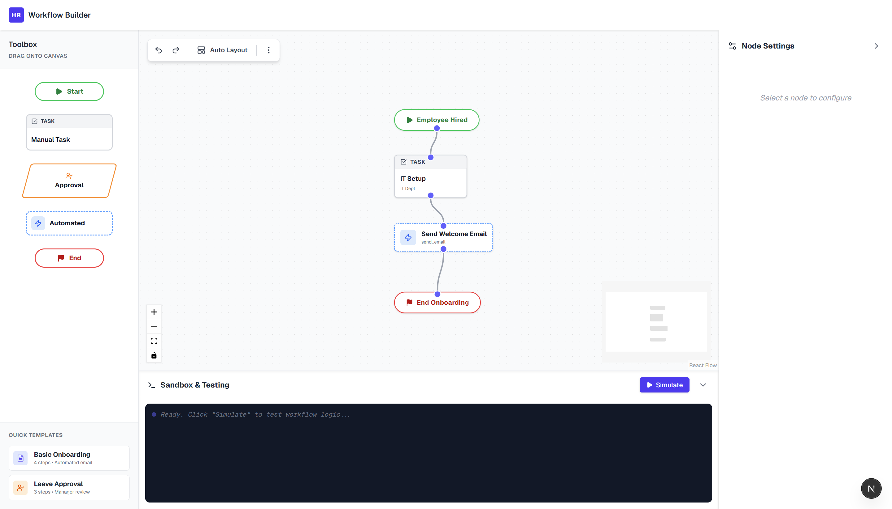
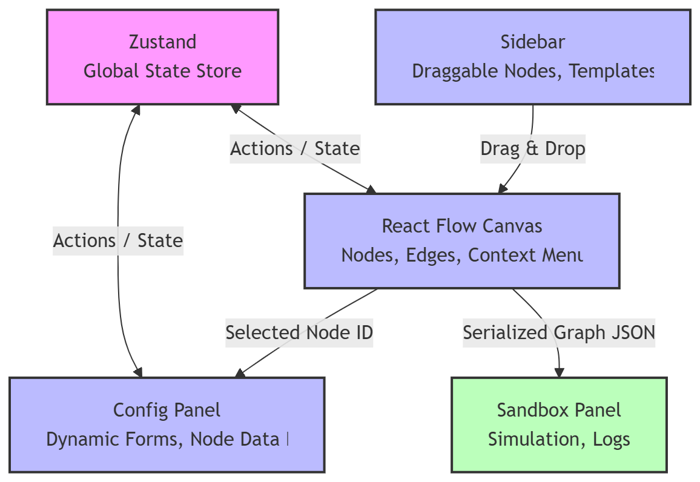

# HR Workflow Designer

A simple drag-and-drop tool to design HR workflows visually. Built using Next.js, React Flow, Zustand, and TypeScript. The goal was to make something that feels easy to use while still handling complex flows.



---

## Features

* Drag and drop canvas to build workflows
* Different node types like Start, End, Tasks, Approvals, and Actions
* Side panel to edit whatever node/edge you click
* Undo/Redo support
* Right-click menu for quick actions (add/delete stuff)
* Auto-layout to clean up messy graphs
* Import/Export workflows as JSON
* Warning before losing unsaved work
* Simple sandbox to simulate workflow execution
* Change node/edge colors

---

## Architecture

This is basically a client-side app built with Next.js.


* **Next.js (App Router)** for structure (runs fully on client for now)
* **React Flow** handles the graph (nodes, edges, zoom, drag, etc.)
* **Zustand** stores all the state (nodes, edges, history for undo/redo)
* **Tailwind CSS** for styling

Code is split into:

* Nodes → custom components for each node type
* Panels → sidebar, config panel, sandbox
* Utils → stuff like auto-layout

---

## How to Run

**Requirements:**

* Node.js (18+)

**Steps:**

```bash
git clone https://github.com/mahespaulj/hr-workflow-designer.git
cd hr-workflow-designer
npm install
npm run dev
```

Open: [http://localhost:3000](http://localhost:3000)

---

## Design Choices

* Used Zustand instead of context to avoid messy state handling
* Sidebar shows actual node previews instead of just labels
* Everything is client-side for now (no backend yet)
* Focused a lot on UX things like undo/redo, resizing panels, warnings, etc.

---

## What’s Done

* Working drag-and-drop editor
* Multiple node types
* Config panel for editing nodes
* Undo/Redo
* Auto-layout
* Import/Export
* Sandbox testing panel

---

## What Could Be Added

* Backend to save workflows
* Real-time collaboration (like multiple users editing)
* Better validation (like detecting broken flows)
* Real API integrations (emails, Slack, etc.)
* Proper testing
* Accessibility improvements